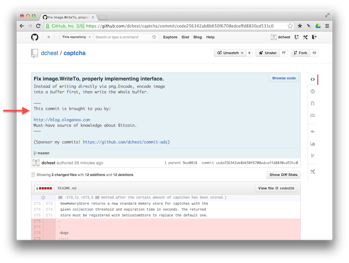

Put your ad into my commit!
===========================

For only **0.01 BTC** (today it's around $10, tomorrow maybe a few millions),
you can sponsor my Git commit!

Here's how it will look:

    commit f681155a4cddc9f5f409eee74a6e6432aa08194c
    Author: Dmitry Chestnykh <dmitry@codingrobots.com>
    Date:   Mon Dec 2 18:35:35 2013 +0100

    Fix the damn bug #123.
    
    ~~~
    This commit is brought to you by:

    Mémoires --  a very nice diary software for Mac!
    http://www.codingrobots.com/memoires/
    ~~~

[**Click here to buy an ad of your dreams!**](https://coinbase.com/checkouts/931d50d2c6af3cbbdd4795633bc04059)

(After your payment arrives, you will be redirected to a form where you can
enter text for your ad. Once I receive your text, I will include it into the
next commit to one of my open source project at https://github.com/dchest
as soon as I have something to commit.)

## Example

Here's the first sponsored commit as it appears on GitHub:

[

## List of sponsored commits

1. https://github.com/dchest/captcha/commit/cede256342ab8b650f6708edceffd8830cd531c0
